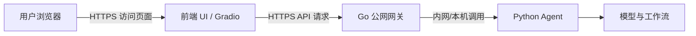

# 公网部署拓扑

这份拓扑基于当前版本：UI 负责前端交互，Go 负责公网承接与治理，Python 负责 agent 编排与模型推理。

## 总体结构

## 角色划分

| 层级 | 角色 | 是否公网暴露 | 说明 |
|---|---|---|---|
| 浏览器 | 用户入口 | 是 | 访问产品页面 |
| UI 层 | 前端壳 | 可选 | 提供表单、聊天区、结果展示 |
| Go 层 | 承接与治理 | 是 | 对外 API、鉴权、限流、日志、超时、路由 |
| Python 层 | Agent / 工作流 | 否 | 只给 Go 调，不直接暴露 |

## 公网入口建议

### 方案 A: 页面和 API 都公网可访问

- `https://your-domain.com` -> UI
- `https://api.your-domain.com` -> Go 网关
- UI 通过环境变量 `GO_API_BASE_URL` 指向 API 域名

适合正式产品，对外访问体验最好。

### 方案 B: 只暴露 API，UI 内部使用

- 只开放 Go API 给内测或程序调用
- UI 放在内网或本地，作为管理台

适合先验证后端闭环。

### 方案 C: 单域名反向代理

- `https://your-domain.com` -> Nginx/Caddy
- `/` 转发到 UI
- `/api/*` 转发到 Go

适合想要一个统一域名的场景。

## 推荐端口与边界

| 组件 | 推荐监听 | 是否对公网开放 | 备注 |
|---|---:|---|---|
| UI | 7860 或反向代理后内部端口 | 否，或经反代暴露 | Gradio 前端 |
| Go | 8088 | 否，或经反代暴露 | 只接反向代理或本机访问 |
| Python Agent | 内部进程/本机脚本 | 否 | 仅由 Go 触发 |

## 请求链路

### 1. 预览解析

1. 用户在 UI 输入自然语言
2. UI 调用 Go 的 `POST /v1/preview`
3. Go 通过 `python_bridge.py` 调 Python
4. Python 返回结构化字段
5. UI 展示字段预览

### 2. 开始执行

1. 用户点击“开始执行”
2. UI 调用 Go 的 `POST /v1/generate`
3. Go 通过 `python_bridge.py` 调 Python
4. Python 进入现有 parser / graph / model 流程
5. 输出结果返回给 UI

### 3. 继续修正

1. 用户输入修正说明
2. UI 仍然调用 `POST /v1/generate`
3. 请求体带上 `revision_note` 和 `workflow_state`
4. Go 转发到 Python 的继续修正流程
5. 返回新的结果和自检状态

## Nginx / Caddy 建议

如果你要真正上公网，建议用反向代理统一入口：

- 443 端口对外
- 80 端口只做跳转到 HTTPS
- UI 与 Go 都不直接暴露裸端口
- 代理层负责 TLS、压缩、请求大小限制、基础安全头

## 最小上线顺序

1. 先在内网起 Go，确认 `/healthz` 和 `/v1/generate` 正常。
2. 再起 UI，并把 `GO_API_BASE_URL` 指向 Go。
3. 最后挂上 Nginx/Caddy，把 UI 和 Go 放进同一个公网域名下。

## 生产建议

- Python 不要直接暴露公网端口。
- Go 只开放必要 API。
- UI 只做前端，不承载工作流。
- 公网访问统一走 HTTPS。
- 如果后续要扩容，Go 和 Python 应拆开成独立服务。
